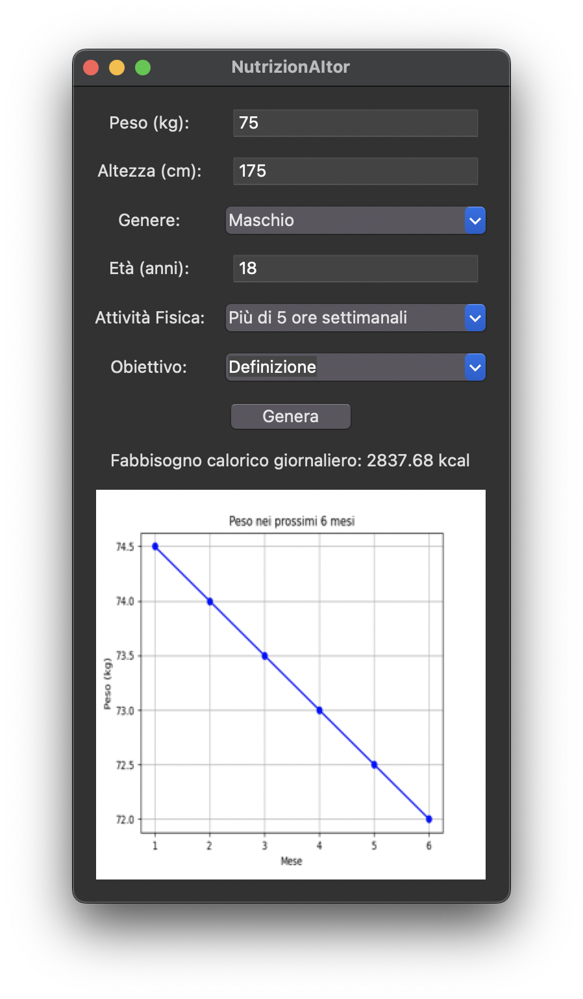

# nutrizionAItor

# NutrizionAItor

## Overview
NutrizionAItor is a Python-based application that generates personalized nutritional plans and projects estimated weight changes over time. By leveraging artificial intelligence, it tailors meal plans according to user-specific data such as weight, height, age, gender, physical activity level, and dietary goals. The program also calculates the user's Total Daily Energy Expenditure (TDEE) and provides a visual representation of weight development over the coming months.

## Features
- User-friendly graphical interface created with Tkinter.
- Integration with MistralAI to generate customized nutritional plans.
- Calculation of TDEE based on user inputs.
- Graphical representation of estimated weight changes over time.
- Options for different dietary goals (weight loss, maintenance, muscle gain).
- Saves the generated nutritional plan to a text file.
- Displays the calculated TDEE within the application.

## Requirements
- Python 3.x
- Tkinter
- `matplotlib`
- `Pillow`
- `mistralai` (Python client for MistralAI)

## Installation
1. Clone the repository:
   ```bash
   git clone https://github.com/yourusername/NutrizionAItor.git
   cd NutrizionAItor
   ```

2. Install the required Python packages:
   ```bash
   pip install tkinter matplotlib pillow mistralai
   ```

3. Set your MistralAI API key as an environment variable:
   ```bash
   export MISTRAL_API_KEY="your_mistralai_api_key"
   ```

## Usage
1. Run the application:
   ```bash
   python nutrizionaitor.py
   ```

2. Enter the required information into the application interface:
   - Weight (kg)
   - Height (cm)
   - Gender
   - Age (years)
   - Physical Activity Level
   - Dietary Goal

3. Click the "Genera" button to generate the nutritional plan. The application will:
   - Calculate your TDEE.
   - Display your TDEE within the application.
   - Generate a personalized nutritional plan.
   - Save the nutritional plan to a file named `dieta.txt`.
   - Display a graph showing the estimated weight changes over the next few months.

## Example
Here's a screenshot of the application interface:



## Contributing
Contributions are welcome! Please fork the repository and submit pull requests for any enhancements or bug fixes.

## License
This project is licensed under the MIT License - see the [LICENSE](LICENSE) file for details.

## Credits
Special thanks to MistralAI for providing the AI platform.

## Contact
For any inquiries or issues, please open an issue on GitHub or contact [your_email@example.com].

---

Feel free to customize the README file as needed for your project. This template includes the essential sections to help users understand, install, and use the NutrizionAItor application.
